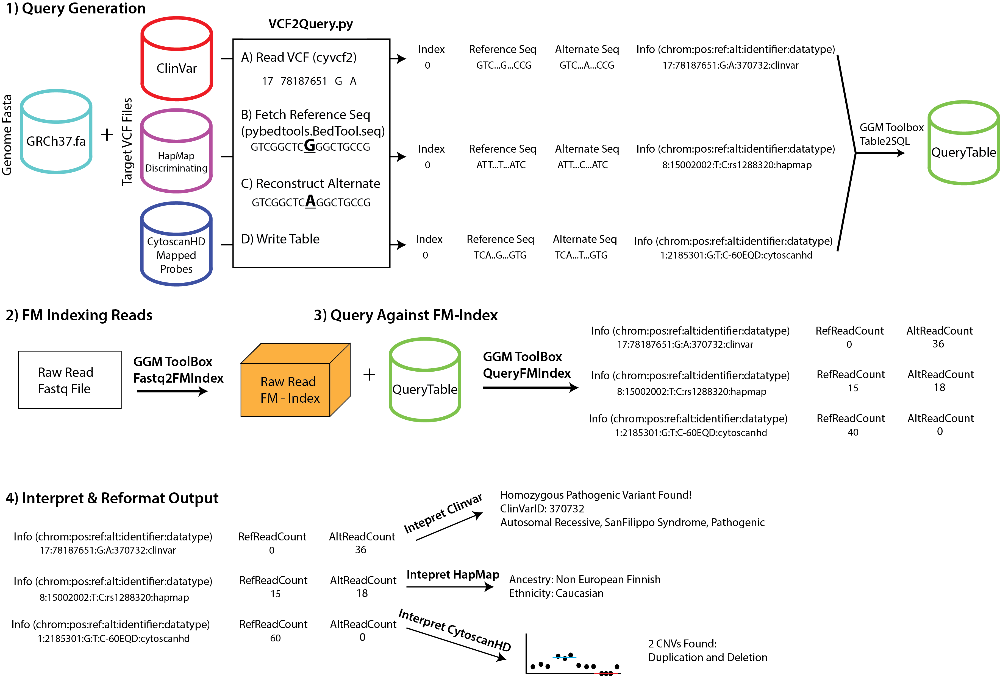
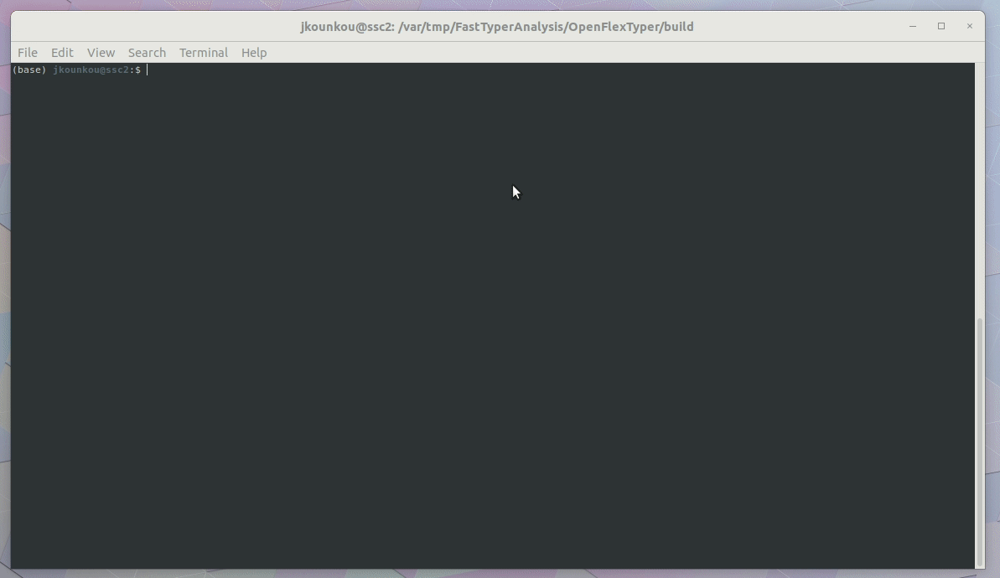

# FlexTyper

[](https://circleci.com/gh/wassermanlab/OpenFlexTyper) [](https://openflextyper.readthedocs.io/en/latest/?badge=latest)
[](https://github.com/wassermanlab/openflextyper/releases/latest)
[](https://opensource.org/licenses/MIT)

The purpose of FlexTyper is to rapidly query an unmapped read file (fastq) for variants/kmers of interest. 
The core of FlexTyper relies on the FM-index of the raw reads, developed by Alice Kaye. 
This indexed read set is designed for rapid queries of kmers, sequence substrings of length ‘k’, against an entire set of unmapped reads. 
With this ability to rapidly scan for substrings against an unmapped read set, we can perform meaningful queries for a variety of applications including genotyping for presence of pathogenic variants, coverage analysis for known probes contained within the CytoscanHD chromosomal microarray set, and ancestry/ethnicity inference from population discriminating polymorphisms. 
The tool is designed in a flexible manner with respect to the query capabilities, making it available for extension to other organisms, genome versions, and applications. 
We anticipate that FlexTyper’s utility will grow as datasets cataloguing variants of interest continue to expand.


## Documentation

For more information about FlexTyper, please refer to our online documentation on [readthedocs](https://flextyper.readthedocs.io/en/latest/)

## Contributers

[](https://github.com/tixii/) |
[](https://github.com/Phillip-a-richmond) |
[](https://github.com/kounkou) |
[](https://github.com/tamario) |
:---: | :---: | :---: | :---: | 
[Alice Kaye](https://github.com/tixii) | [Phillip Richmond](https://github.com/Phillip-a-richmond) | [Jacques Kounkou](https://github.com/kounkou) | [Tamar Av-Shalom](https://github.com/tamario)


## Overview




## Quick start installation

OpenFlexTyper is installed with the install.sh script provided in the repository. 
The installation assumes that you have **git** installed.
git is by default available on cedar. On sockeye, you can load git module with 

```bash
module load git
```

Open a terminal and enter :

```bash
git clone https://github.com/wassermanlab/OpenFlexTyper.git
cd OpenFlexTyper
bash install.sh
```

That's it !


## Demo




## License

The MIT License (MIT)

Copyright (c) 2019, Wasserman lab

Permission is hereby granted, free of charge, to any person obtaining a copy of this software and associated documentation files (the "Software"), to deal in the Software without restriction, including without limitation the rights to use, copy, modify, merge, publish, distribute, sublicense, and/or sell copies of the Software, and to permit persons to whom the Software is furnished to do so, subject to the following conditions:

The above copyright notice and this permission notice shall be included in all copies or substantial portions of the Software.

THE SOFTWARE IS PROVIDED "AS IS", WITHOUT WARRANTY OF ANY KIND, EXPRESS OR IMPLIED, INCLUDING BUT NOT LIMITED TO THE WARRANTIES OF MERCHANTABILITY, FITNESS FOR A PARTICULAR PURPOSE AND NONINFRINGEMENT. IN NO EVENT SHALL THE AUTHORS OR COPYRIGHT HOLDERS BE LIABLE FOR ANY CLAIM, DAMAGES OR OTHER LIABILITY, WHETHER IN AN ACTION OF CONTRACT, TORT OR OTHERWISE, ARISING FROM, OUT OF OR IN CONNECTION WITH THE SOFTWARE OR THE USE OR OTHER DEALINGS IN THE SOFTWARE.
