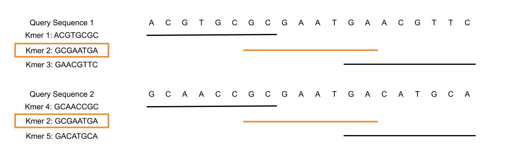

\page parameters 

# Key Parameters Used within FlexTyper 

## Sliding Search Parameters 

## Centered Search Parameters 

## Non Unique Kmers
If two query sequences contain an identical kmer, then that kmer is flagged as a ‘non unique kmer’. 

## Over Counted Kmers 
If a kmer search returns too many positions, then that kmer is disregarded as uninformative and flagged as an “over counted kmer”. 

## Count As Pairs 
For paired reads [R1 = <1,1>, R2 = <1,2>]

If countAsPairs = true, then if a query matches R1 and R2, then the query count is only one. 

## Unique Reads 
For two queries Q1 and Q2, uniqueReads = true, then if a read, R, matches Q1 and Q2, then R will be removed from the set of matching read hits for both Q1 and Q2.

# Combining countAsPairs and uniqueReads
Suppose you have 3 sets of paired reads: 

Pair 1: [R1 = <1,1>, R2 = <1,2>]

Pair 2: [R3 = <2,1>, R4 = <2,2>]

Pair 3: [R5 = <3,1>, R6 = <3,2>] 

And two query sequences with matching read hits: 

Query 1 = [R1, R3, R5, R6]

Query 2 = [R1, R4]

<table>
<caption id="multi_row">Expected Results</caption>
<tr><th rowspan="2">                     <th colspan="3" >countAsPairs=True   <th colspan="3" >countAsPairs= False       
<tr><th> Query <th> Read Hits <th> Count <th> Query <th> Read Hits <th> Count 
<tr><td rowspan="2">uniqueReads = True<td>1<td>[R5, R6]<td>1<td>1<td>[R3,R5,R6]<td>3  
                                      <tr><td>2<td>[ ]<td>0<td>2<td>[R4]<td>1  
<tr><td rowspan="2">uniqueReads = True<td>1<td>[R1, R3, R5, R6]<td>3<td>1<td>[R1,R3,R5,R6]<td>4  
                                      <tr><td>2<td>[R1, R4]<td>2<td>2<td>[R1,R4]<td>2  

</table>

